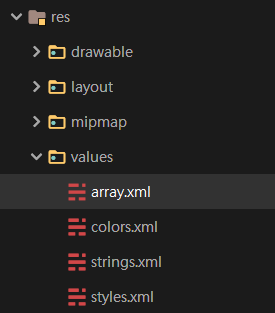
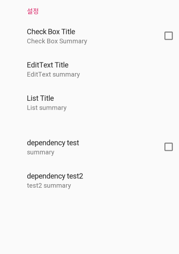

# SettingPreference

***

## Basis

	오늘은 안드로이드 앱을 만들 때 자주 접하게 될 settingPreference에 대하여 정리했다.
	settingPreference는 Activity외에 다른 xml로 setting에 대한 메뉴를 먼저 정의해준다.
	그 정의를 fragment로 불러들여와서 표현하는 형식이 바로 settingPreference다.

 

## deprecated

	내가 쓰던 Preference는 deprecated되었다. API level 29에서 버려졌다. 마음이 아프다.
	그래도 Use the AndroiX Preference Library라고 명시해주며, 대안책을 내놓았다. 갓글
	
 이미지출처 : <a href="https://developer.android.com/reference/android/preference/PreferenceScreen" target="_blank">PreferenceScreen Android reference</a>, 내 노트북 안드로이드 스튜디오
	
	
	
## 1.implementation 추가하기

	기존의 Preference가 deprecated되면서 androidx의 preference를 사용해야 된다.
	이를 위해서는 앱수준의 gradle(build.gradle(Module:app)에 dependencies를 추가해준다. 
	
~~~xml
implementation 'androidx.preference:preference:1.1.0-rc01'
~~~

## 2. setting_preference.xml 만들기

	사진과 같이 res에 xml 디렉토리를 하나 만들어서 settings_preference.xml을 만들어 원하는 기능을 추가한다. 여기서는 CheckBox, EditText, List, 의존성 기능을 넣었다. (파일 이름은 달라도 상관 없어요)
	
	
~~~xml
<?xml version="1.0" encoding="utf-8"?>
<androidx.preference.PreferenceScreen
    xmlns:android="http://schemas.android.com/apk/res/android">
    <androidx.preference.PreferenceCategory android:title="설정">

        <androidx.preference.CheckBoxPreference
            android:defaultValue="true"
            android:key="key_chk_box"
            android:summary="Check Box Summary"
            android:title="Check Box Title" />
        <androidx.preference.EditTextPreference
            android:defaultValue="test"
            android:key="key_edit_text"
            android:summary="EditText summary"
            android:title="EditText Title" />

        <androidx.preference.ListPreference
            android:defaultValue="ko"
            android:entries="@array/language"
            android:entryValues="@array/language_value"
            android:key="key_language"
            android:negativeButtonText="@null"
            android:positiveButtonText="@null"
            android:summary="List summary"
            android:title="List Title" />

        <androidx.preference.PreferenceCategory>

            <androidx.preference.CheckBoxPreference
                android:defaultValue="false"
                android:key="key_dependent"
                android:summary="summary"
                android:title="dependency test" />

            <Preference
                android:dependency="key_dependent"
                android:key="key_dependent_child"
                android:summary="test2 summary"
                android:title="dependency test2" />
        </androidx.preference.PreferenceCategory>

    </androidx.preference.PreferenceCategory>

</androidx.preference.PreferenceScreen>
~~~

		
~~~xml
<androidx.preference.PreferenceCategory>

            <androidx.preference.CheckBoxPreference
                android:defaultValue="false"
                android:key="key_dependent"
                android:summary="summary"
                android:title="dependency test" />

            <Preference
                android:dependency="key_dependent"
                android:key="key_dependent_child"
                android:summary="test2 summary"
                android:title="dependency test2" />
        </androidx.preference.PreferenceCategory>
~~~
	이 부분은 CheckBox가 체크되면 활성화 되는 부분으로서, dependency 속성이 추가된다.
	
#### 2.1 ListPreference 리스트 추가하기

	앞서 settings_preference.xml에서 ListPreference를 썼는데, 그렇다면 해당 ListPreference를 클릭하면 List가 뜨게 하기위하여 List를 만들어보자. 먼저 values에 array.xml을 하나 추가한다. 아래 사진처럼

	그 다음 array.xml에 원하는 array를 작성해준다.

~~~xml
<?xml version="1.0" encoding="utf-8"?>
<resources>
    <string-array name="language">
        <item>Korean</item>
        <item>English</item>
        <item>Chinese</item>
    </string-array>

    <string-array name="language_value">
        <item>ko-kr</item>
        <item>eng</item>
        <item>chin</item>
    </string-array>

</resources>
~~~

	이때 language와 language_value 2가지를 넣었는데, language는 실질적으로 사용자에게 보여주는 List이며,
	language_value는 SharedPreference에 저장될 값이다.
	SharedPreference는 나중에 정리를 할 것이니 모르겠다면 구글에 검색해보자. 갓글
	
---

	ListPreference에 넣을 List를 만들었다면 다시 아까 작성했던 ListPreference를 보자
	
~~~xml
<androidx.preference.ListPreference
            android:defaultValue="ko"
            android:entries="@array/language"
            android:entryValues="@array/language_value"
            android:key="key_language"
            android:negativeButtonText="@null"
            android:positiveButtonText="@null"
            android:summary="List summary"
            android:title="List Title" />
~~~

	위 코드에서 android:entries="@array/language"를 통해 실질적으로 보여주며,
	android:entryValues="@array/language_value"에서 순차적으로 해당 값들에 대한
	key값을 부여해주었다.
	
## 3. Fragment로 띄워주기

	위에 진행과정들을 다 하고나면 사진과 같이 settings_preference.xml에서 preview를 볼 수 있을 것이다. 
	이제 이 완성된 Preference를 fragment를 통해 띄워줘야한다.
	이때 fragment는 Activity 내에 생성되는, UI 구성을 여러 개의 모듈 단위로 작성할 수 있도록 해주는 기능이다.
	또한 구글에서는 다음과 같이 fragment를 정의하고 있다.
	
---

	fragment는 자체 수명 주기를 가지고, 자체 입력 이벤트를 받으며,
	액티비티 실행 중에 추가 및 제거가 가능한 액티비티의 모듈식 섹션이라고 생각하면 된다.
	(다른 액티비티에 재사용할 수 있는 "하위 액티비티"와 같은 개념)

참고 : <a href="https://recipes4dev.tistory.com/58" target="_blank">개발자를 위한 레시피</a>

### 3.1 SettingFragment.java

	settings_preference.xml을 onCreate해주고 각 기능들을 정의해줄 java파일을 하나 만든다. 이때 extends해주는 것은 PreferenceFragmentCompat이다. 다른 것들은 deprecated 됐으니까 이거를 써줘야한다.

~~~java
public class SettingFragment extends PreferenceFragmentCompat
~~~